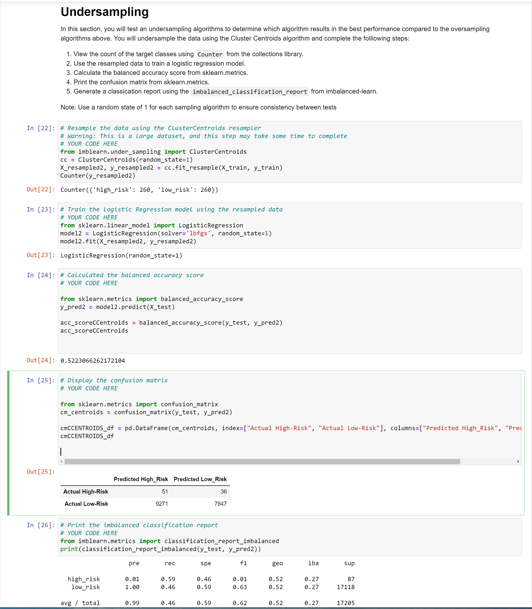
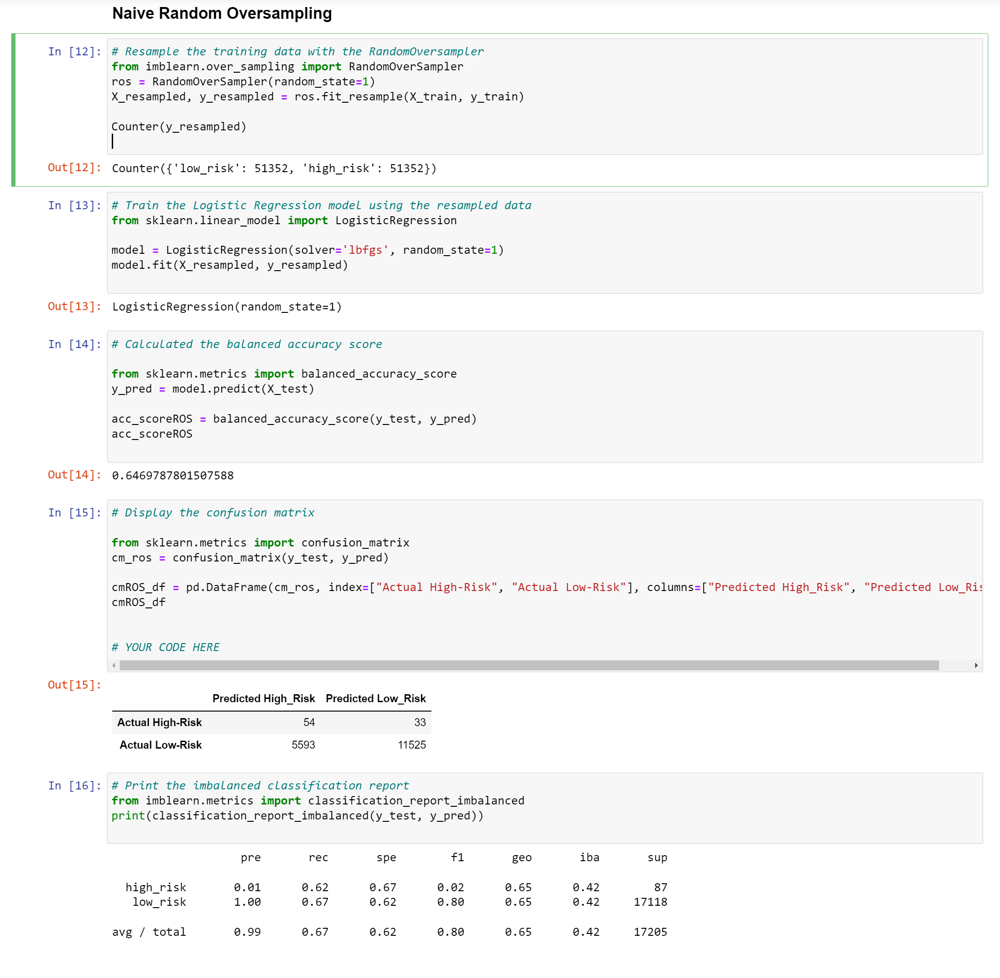
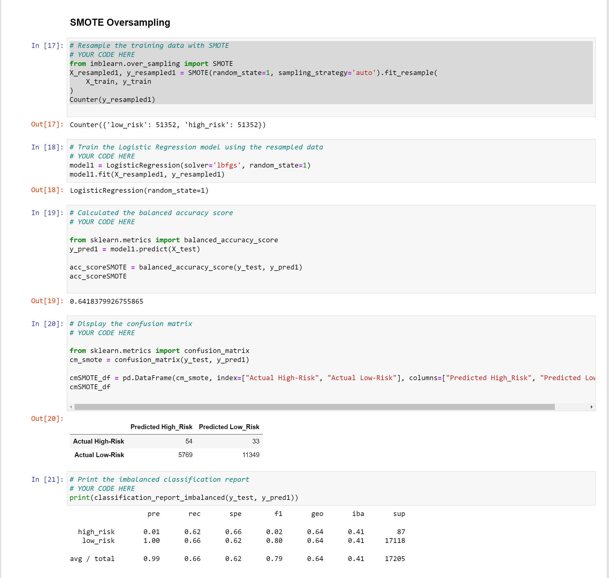
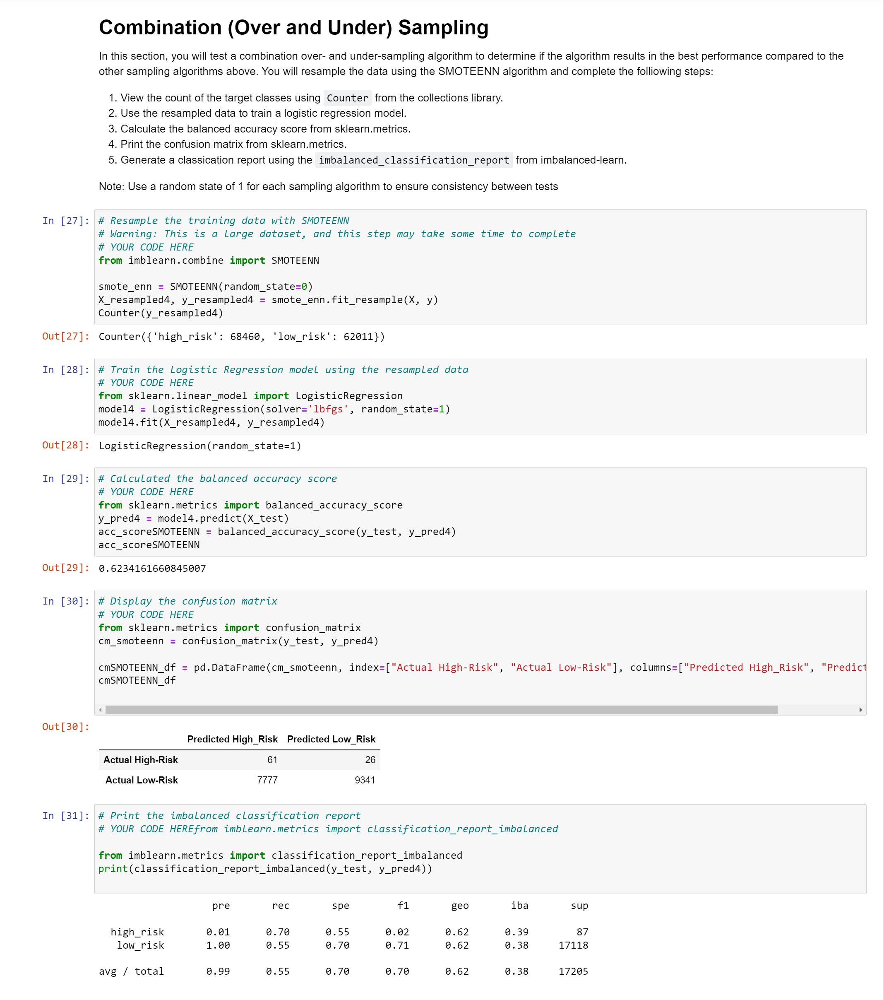
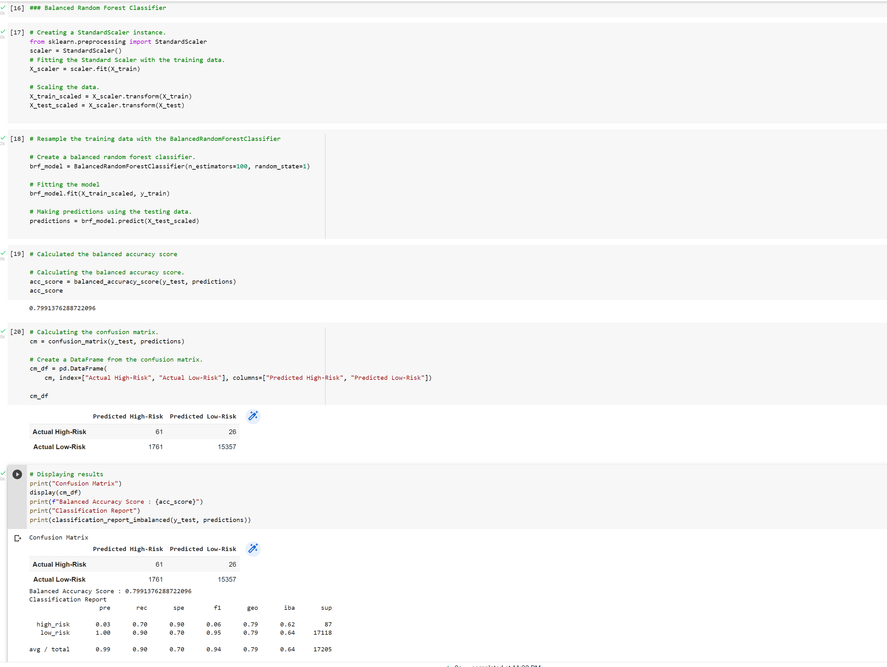
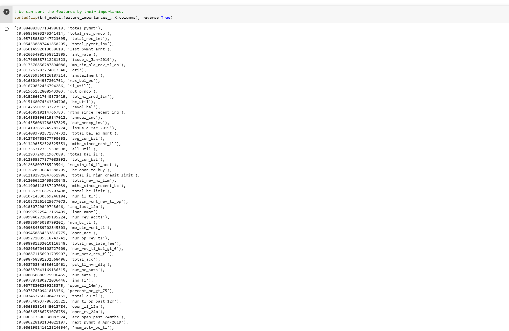
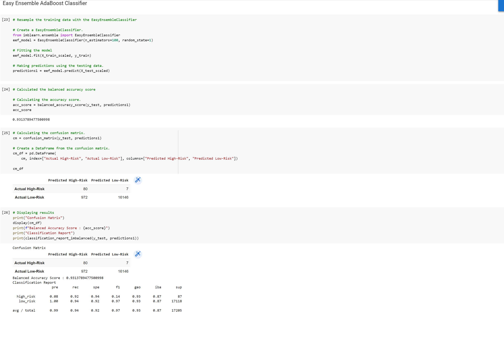

# Credit_Risk_Analysis

# Overview of objective and process for Challenge 17 study:

## Challenge 17 consists of applying supervised machine learning to customer loan data in order to predict high-risk and low risk loan applicants. Binary classification techniques are used to train the features data in order to make predictions about loan status.

* The high-risk customers are the minority class.
* The low-risk customers are the majority class.
* The string variable values are converted into numeric values using the get_dummies() method.
* The customer loan input dataset is divided into 2 datasets: features (X) and target (y).
* The features dataset contains multiple loan history parameters for each customer.
* The target dataset contains the "loan_status" (high-risk or low-risk) for each customer. 
* The X and y datasets are then segregated into "train" and "test" datasets.
* In the first analyses (Del. 1 & 2), a Logistic regression classifier model is applied separately to the features data sampled different sampling techniques.
* In the second analyses, 2 Ensemble classifier models are applied separately to the same scaled features values.

## Deliverables:

* Deliverables 1: 
    * Oversample minority class with RandomOverSampler (used as first input to logistical regression).
    * Oversample minority class with SMOTE (used as second input to logistical regression).
    * Undersample majority class with ClusterCentroids (used as third input to logistical regression).
    * Create accuracy score, confusion matrix, and imbalanced classification report for each LR output above.
    * see screenshots for the 3 Deliverable 1 outputs for acc_scores, confusion_matrices, & imbalanced classification reports.

* Deliverables 2:    
    * Combination (over and under) sampling using SMOTEENN (used as fourth input to logistic regression).
    * Create accuracy score, confusion matrix, and imbalanced classification report for the LR output above.
    * see screenshot for the Deliverable 2 output for acc_score, confusion_matrix, & imbalanced classification report.

* Deliverable 3:
    * Normalize the values in the feature columns using the StandardScaler() method.
    * Train the normalized values from above using the BalancedRandomForestClassifier.
    * Create accuracy score, confusion matrix, and imbalanced classification report for the BRF output.
    * see screenshot for the BRF Deliverable 3 output for acc_score, confusion_matrix, & imbalanced classification report.

    * Train the normalized values from above using the EasyEnsembleClassifier.
    * Create accuracy score, confusion matrix, and imbalanced classification report for the EEC output.
    * see screenshot for the EEC Deliverable 3 output for acc_score, confusion matrix, & imbalanced classification report.

## Summary:

    * The output from the undersampled (CC) majority class in Deliverable 1 yielded the lowest (poorest) values for acc_score, precision, recall, and f1.
    * The outputs from the oversampled (ros & SMOTE) minority class in Del. 1 & combo-sampling (SMOTEENN) in Del. 2 yielded very similar values for acc_scores, precision, recall, and f1. Overall values are better than undersampled for Del. 1, but still poor.
    * The Deliverable 3 output from the RandomForestClassifier yielded superior values for acc_score, prediction, recall, and f1, compared to the corresponding values from Deliverables 1 or 2.
    * The Deliverable 3 output from the EasyEnsembleClassifier yielded the BEST values for acc_score, precision, recall, and f1.
    * Based on the results from this dataset, I recommend the EasyEnsembleClassifier and corresponding work flow for best predictions.

## Screenshots:

* screenshot for undersampled (CC) Deliverable 1 output: acc_score, confusion_matrix, & classification report.

* screenshot for oversampled (ros) Deliverable 1 output: acc_score, confusion_matrix, & classification report.

* screenshot for oversampled (SMOTE) Deliverable 1 output: acc_score, confusion_matrix, & classification report.

* screenshot for combo-sampled (SMOTEENN) Deliverable 2 output: acc_score, confusion_matrix, & classification report.

* screenshot for BalancedRandomForestClassifier Deliverable 3 output: acc_score, confustion_matrix, & classification report. 

* screenshot for BalancedRandomForestClassifier Deliverable 3 output: feature importance sorted in descending order.

* screenshot for EasyEnsembleClassifier Deliverable 3 output: acc_score, confustion_matrix, & classification report.

